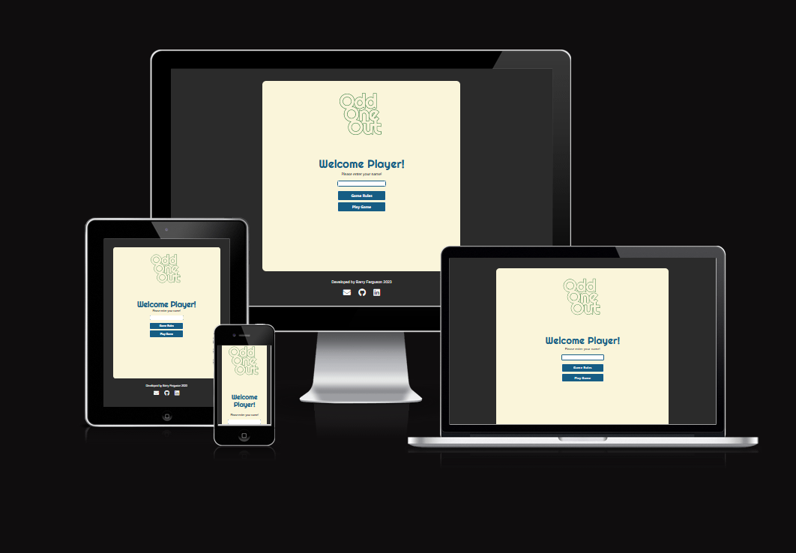

# Odd One Out
(Developer: Barry Ferguson)

[Live Webpage] (https://fergie-b.github.io/xxxxx

## Table of Contents

1. [Project Goals](#project-goals)
    1. [User Goals](#user-goals)
    2. [Site Owner Goals](#site-owner-goals)
2. [User Experience](#user-experience)
    1. [Target Audience](#target-audience)
    2. [User Requirements and Expectations](#user-requirements-and-expectations)
    3. [User Stories](#user-stories)
3. [Design](#design)
    1. [Design Choices](#design-choices)
    2. [Colour](#colours)
    3. [Fonts](#fonts)
    4. [Logo](#logo)
    5. [Structure](#structure)
    6. [Wireframes](#wireframes)
4. [Technologies Used](#technologies-used)
    1. [Languages](#languages)
    2. [Frameworks & Tools](#frameworks-&-tools)
5. [Features](#features)
6. [Testing](#validation)
    1. [HTML Validation](#HTML-validation)
    2. [CSS Validation](#CSS-validation)
    3. [JavaScript Validation](#javascript-validation)
    4. [Accessibility](#accessibility)
    5. [Performance](#performance)
    6. [Device and Browser testing](#device-and-browser-testing)
    7. [Testing user stories](#testing-user-stories)
8. [Bugs](#Bugs)
9. [Deployment](#deployment)
10. [Credits](#credits)
11. [Acknowledgements](#acknowledgements)

## Project Goals

The Project Goal was to create an engaging, interactive and user-friendly image picking game with bonus questions to score extra points.

### User Goals
- To play a game with clear rules
- Challenge the user to workout which picture contains the Odd One Out
- To get a high score by answering bonus questions

### Site Owner Goals
- To create a challenging and entertaining game
- To create a game with a visually appealing design with clean graphics
- Provide the user with an easy to use navigation system
- To create a game website that is fully responsive and passes accesibility guidelines

## User Experience

### Target Audience
- Adult users who enjoy General Knowledge quizzes
- Adult users who enjoy imagery based games

### User Requirements and Expectations
- Clear game rules
- An Uncomplicated navigation system
- Straightforward content presentation
- A Game website that is fully responsive and that can be accessed on any device
- Logging of high scores
- To be able to leave feedback with the developer of the game

### User Stories

### Site User
1.	As a user of the website, I want the rules of the game to be simple and explained easily
2.	As a user of the website, I want to be able to enter my name for recording a high score
3.	As a user of the website, I want to be given the option to choose a difficulty level to play the game at
4.	As a user of the website, I want to presented with General Knowledge questions to test that skill    
5.	As a user of the website, I want the game to be clickable on desktop and touchscreen on tablet and mobile devices
6.	As a user of the website, I want to see clear images of the odd one out image at all screen sizes
7.	As a user of the website, I want to see the correct answer if I get the question wrong
8.	As a user of the website, I want to see my current score
9.	As a user of the website, I want to be able to contact the developer of the game to leave feedback
10.	As a user of the website, I want to know my message has been sent to the developer

### Site Owner
11.	I want the users to enjoy the game experience by it being easy to understand and engage with
12. I want the game to be challenging to the user
13.	I want the game to be fully reponsive and work across all devices
14.	If the user encounters and error on the site I want a 404 page to be available to bring them back to the home page
15. I want to be able to receive feedback so the game can be improved 

## Design

### Design Choices
...........

### Colours
The color scheme was chosen on [Coolors.co](https://coolors.co/faf5da-2b2b2b-4281a4-2c7a2a-c44536) after generation on [Colorsafe.co](http://colorsafe.co/) The #2b2b2b Body Text was also tested for legibility against the Modal background colour #FAF5DA on the [WebAIM Contrast Checker](https://webaim.org/resources/contrastchecker/) as was the Secondary colours

Odd One Out Colour Scheme

Odd One Out Black Text Contrast Testing

Odd One Out Secondary Colours Contrast Testing

### Fonts

  

### Logo
........

Logo

### Structure
................
#### Site Pages:
-
-
-
-
-
-

### Wireframes

Laptop & Desktop Screens

Tablet Screens

Mobile Device Screens

## Technologies Used

### Languages
- HTML5
- CSS3
- JS

### Frameworks & Tools
- [Git](https://git-scm.com/)
- [Github](https://github.com/)
- [Gitpod](https://gitpod.io/workspaces)
- Adobe Photoshop
- Adobe Illustrator
- [Balsamiq](https://balsamiq.com/)
- [Coolors.co](https://coolors.co/)
- [Google Fonts](https://fonts.google.com/)
- [Favicon.io](https://favicon.io/)
- [Font Awesome](https://fontawesome.com/)

## Features
The Main features of the odd One Out website span across ......

###  Section
-
- 
- 
- 
- 
- User Stories covered: xx

### Section
-
- User Stories covered: xx

### Section
-
- User Stories covered: x

### Section
-
- User Stories covered: xxx

### Section
- 

### Section
- 
- 
- 
- User Stories covered: xxxx

###  Section
- 
- - User Stories covered: xxxx

### Section
- 
- User Stories Covered: xxxx

###  Section
- 
- User stories covered: xxxx

###  Section
- 
- User stories covered: xxxx

### Section
- 
- User stories covered: xxxx

### 404 Section
- 
- User stories covered: xxxx

### Footer
- 
- User Stories covered: xxxx

## Validation

### HTML Validation
The [W3C Markup Validation Service](https://validator.w3.org/) .......

/summary>

### CSS Validation
The [W3C CSS Validation Service](https://jigsaw.w3.org/css-validator/validator) ......

Style CSS Success Result

Full Page Breakdown

  
 ### JavaScript Validation
 [JSHint](https://jshint.com/)

.js

.js

.js

### Accessibility
The site pages where checked using the [Web AIM Wave Web Accessibility Evaluation Tool](https://wave.webaim.org/).....

### Performance Testing
The Game website was tested in Google Lighthouse to see how it performs.

page

page

page

page

### Device and Browser Testing
Odd One Out Game Website was tested on the devices and browsers listed:
- 
-
- 
- 

### Testing User Stories

1. As a first-time user of the website, ......

| **Feature** | **Action** | **Expected Result** | **Actual Result** |
|-------------|------------|---------------------|-------------------|
| xxxxxxxxxxe | xxxxxxxxxx | xxxxxxxxxx | xxxxxxxxxx |
| xxxxxxxxxxx | xxxxxxxxxx | xxxxxxxxxx | xxxxxxxxxx |

Screenshots

2. As a first-time user of the website, ......

| **Feature** | **Action** | **Expected Result** | **Actual Result** |
|-------------|------------|---------------------|-------------------|
| xxxxxxxxxxe | xxxxxxxxxx | xxxxxxxxxx | xxxxxxxxxx |
| xxxxxxxxxxe | xxxxxxxxxx | xxxxxxxxxx | xxxxxxxxxx |

Screenshots

3. As a first-time user of the website, ......

| **Feature** | **Action** | **Expected Result** | **Actual Result** |
|-------------|------------|---------------------|-------------------|
| xxxxxxxxxxe | xxxxxxxxxx | xxxxxxxxxx | xxxxxxxxxx |

Screenshots

4. As a first-time user of the website, ......

| **Feature** | **Action** | **Expected Result** | **Actual Result** |
|-------------|------------|---------------------|-------------------|
| xxxxxxxxxxe | xxxxxxxxxx | xxxxxxxxxx | xxxxxxxxxx |

Screenshots

5. As a first-time user of the website, ......

| **Feature** | **Action** | **Expected Result** | **Actual Result** |
|-------------|------------|---------------------|-------------------|
| xxxxxxxxxxe | xxxxxxxxxx | xxxxxxxxxx | xxxxxxxxxx |

Screenshots

6. As a first-time user of the website, ......

| **Feature** | **Action** | **Expected Result** | **Actual Result** |
|-------------|------------|---------------------|-------------------|
| xxxxxxxxxxe | xxxxxxxxxx | xxxxxxxxxx | xxxxxxxxxx |

Screenshots

7. As a returning user of the website, I want to be ........

| **Feature** | **Action** | **Expected Result** | **Actual Result** |
|-------------|------------|---------------------|-------------------|
| xxxxxxxxxxe | xxxxxxxxxx | xxxxxxxxxx | xxxxxxxxxx |

Screenshots

8. As a returning user of the website, I want to be ........

| **Feature** | **Action** | **Expected Result** | **Actual Result** |
|-------------|------------|---------------------|-------------------|
| xxxxxxxxxxe | xxxxxxxxxx | xxxxxxxxxx | xxxxxxxxxx |

Screenshots

9. As a returning user of the website, I want to be ........

| **Feature** | **Action** | **Expected Result** | **Actual Result** |
|-------------|------------|---------------------|-------------------|
| xxxxxxxxxxe | xxxxxxxxxx | xxxxxxxxxx | xxxxxxxxxx |

Screenshots

10. As a returning user of the website, I want to be ........

| **Feature** | **Action** | **Expected Result** | **Actual Result** |
|-------------|------------|---------------------|-------------------|
| xxxxxxxxxxe | xxxxxxxxxx | xxxxxxxxxx | xxxxxxxxxx |

Screenshots

11. As the site owner of the website, I want to be able to .....

| **Feature** | **Action** | **Expected Result** | **Actual Result** |
|-------------|------------|---------------------|-------------------|
| xxxxxxxxxxe | xxxxxxxxxx | xxxxxxxxxx | xxxxxxxxxx |

Screenshots

12. As the site owner of the website, I want to be able to .....

| **Feature** | **Action** | **Expected Result** | **Actual Result** |
|-------------|------------|---------------------|-------------------|
| xxxxxxxxxxe | xxxxxxxxxx | xxxxxxxxxx | xxxxxxxxxx |

Screenshots

13. As the site owner of the website, I want to be able to .....

| **Feature** | **Action** | **Expected Result** | **Actual Result** |
|-------------|------------|---------------------|-------------------|
| xxxxxxxxxxe | xxxxxxxxxx | xxxxxxxxxx | xxxxxxxxxx |

Screenshots

14. As the site owner of the website, I want to be able to .....

| **Feature** | **Action** | **Expected Result** | **Actual Result** |
|-------------|------------|---------------------|-------------------|
| xxxxxxxxxxe | xxxxxxxxxx | xxxxxxxxxx | xxxxxxxxxx |

Screenshots

## Bugs

| **Bug** | **Fix** |
| ----------- | ----------- |
| xxxxxxxxxx | xxxxxxxxxx |
| xxxxxxxxxx | xxxxxxxxxx |
| xxxxxxxxxx | xxxxxxxxxx |
| xxxxxxxxxx | xxxxxxxxxx |

## Deployment

I deployed the website on Github pages as per the following instructions:
1. In your Github Repository click on the Settings link in the tob sub navbar
2. In the left sidebar click on the Pages link
3. Select your branch as 'Main' and 'Root'
4. The Webpage will generate and you will receive a message stating "Your site is published at"

To fork a repository, follow these steps:
1. Navigate to the chosen repository
2. Click the Fork Icon on the button in the top right hand corner
3. Choose an optional name and description for your fork
4. Choose the desired forking scenario and click ####Create

To Clone a directory
1. On your Github repository, look at the area above the list of files
2. Click the Button with the down arrow marked 'Code'
3. Copy the URL for the repository under one of the three options: HTTPS, SSH or GitHub CLI
4. Open Git bash
5. Change the name of the current directory to your chosen location
6. Type in 'git clone' and paste your copied URL
7. Hit Enter and create your clone

## Credits

### Media
In order of Appearance:
Images used on the site are not the property of the developer unless stated*
- 
- 
- 
- 
- 
- 

### Code
-
- 
- 
- The 404 Page was built using instructions from [Github](https://docs.github.com/en/pages/getting-started-with-github-pages/creating-a-custom-404-page-for-your-github-pages-site)

## Acknowledgements
